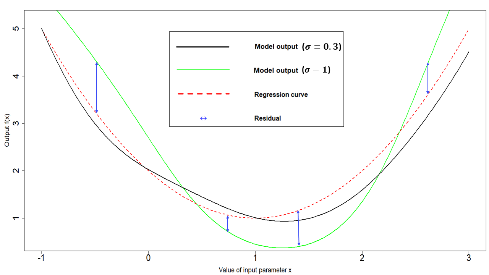

--- 
title: "Workshop 1: calibrating a deterministic model"
author: "Danny Scarponi, Andy Iskauskas"
site: bookdown::bookdown_site
output:
    bookdown::pdf_book:
        includes:
            in_header: header.tex
    bookdown::gitbook:
        config:
            sharing: null
        css: 'style.css'
        highlight: tango
        includes:
            in_header: _toggle.html
        keep_md: TRUE
bibliography: references.bib  
linkcolor: blue
documentclass: book
link-citations: yes
description: "An interactive introduction to the hmer package"
---

```{r, child = "_setup.Rmd", include = F, purl = F, cache = F}
```


```{r setup, include=F}
knitr::opts_chunk$set(echo = TRUE, cache =T)
chosen_params <- list(b = 1/(76*365), mu = 1/(76*365), beta1 = 0.214, beta2 = 0.107, beta3 = 0.428, lambda = 1/7, alpha = 1/50, gamma = 1/14, omega = 1/365)
library(hmer)
library(deSolve)
library(ggplot2)
library(reshape2)
library(purrr)
library(tidyverse)
set.seed(123)
ode_results <- function(parms, end_time = 365*2) {
  forcer = matrix(c(0, parms['beta1'], 100, parms['beta2'], 180, parms['beta2'], 270, parms['beta3']), 
                  ncol = 2, byrow = TRUE)
  force_func = approxfun(x = forcer[,1], y = forcer[,2], method = "linear", rule = 2)
  des = function(time, state, parms) {
    with(as.list(c(state, parms)), {
      dS <- b*(S+E+I+R)-force_func(time)*I*S/(S+E+I+R) + omega*R - mu*S
      dE <- force_func(time)*I*S/(S+E+I+R) - lambda*E - mu*E
      dI <- lambda*E - alpha*I - gamma*I - mu*I
      dR <- gamma*I - omega*R - mu*R
      return(list(c(dS, dE, dI, dR)))
    })
  }
  yini = c(S = 900, E = 100, I = 0, R = 0)
  times = seq(0, end_time, by = 1)
  out = deSolve::ode(yini, times, des, parms)
  return(out)
}
get_results <- function(params, times, outputs) {
  t_max <- max(times)
  all_res <- ode_results(params, t_max)
  actual_res <- all_res[all_res[,'time'] %in% times, c('time', outputs)]
  shaped <- reshape2::melt(actual_res[,outputs])
  return(setNames(shaped$value, paste0(shaped$Var2, actual_res[,'time'], sep = "")))
}
```

# Objectives
This workshop offers an interactive introduction to the main functionality of the 
[hmer](https://cran.r-project.org/web/packages/hmer/index.html) package, using a simple example of an epidemiological model. [hmer](https://cran.r-project.org/web/packages/hmer/index.html) allows you to efficiently implement the Bayes Linear emulation and history matching process, a calibration method that  has been successfully employed in several sciences (epidemiology, cosmology, climate science, systems biology, geology, energy systems etc.). 

In this workshop, you will be invited to carry out a series of tasks (see "Task" boxes) which will enhance your understanding of the package and its tools. Thanks to these activities, you will learn to calibrate deterministic models using history matching and model emulation, and to use your judgement to customise the process. This workshop should be considered as a natural continuation of [Tutorial 1](https://danny-sc.github.io/Tutorial_1/), which introduces the history matching with emulation framework with a one-dimensional example, and of [Tutorial 2](https://danny-sc.github.io/Tutorial_2), which gives a general overview of the history matching with emulation process for deterministic models, and shows how to perform it using [hmer](https://cran.r-project.org/web/packages/hmer/index.html). Following Workshop 1, you may also want to read Workshop 2, where we demonstrate how to calibrate stochastic models. 

For further discussion and justification of the various stages of the history matching with emulation process, please see @bower2010galaxy and @vernon2018bayesian.

# Introduction to the model {#intro}
In this section we introduce the model that we will work with throughout our workshop. 

The model that we chose for demonstration purposes is a deterministic  <span class="abbr" title="A model consisting of four compartments 

- $S$: Susceptible individuals,
- $E$: Exposed individuals (i.e. people that are infected but not infectious yet), 
- $I$: Infectious individuals,  
- $R$: Recovered individuals, 

and four possible transitions

- $S \rightarrow E$, when a susceptible individual becomes infected, 
- $E \rightarrow I$, when an infected individual becomes infectious,
- $I \rightarrow R$, when an infectious individual recovers,
- $R \rightarrow S$, when a recovered individual becomes susceptible again.

SEIRS models are used to study those infectious diseases that do not confer permanent immunity."><abbr title="A model consisting of four compartments 

- S: Susceptible individuals,
- E: Exposed individuals (i.e. people that are infected but not infectious yet), 
- I: Infectious individuals,  
- R: Recovered individuals, 

and four possible transitions

- S to E, when a susceptible individual becomes infected, 
- E to I, when an infected individual becomes infectious,
- I to R, when an infectious individual recovers,
- R to S, when a recovered individual becomes susceptible again.

SEIRS models are suitable to study those infectious diseases that have an incubation period and do not confer permanent immunity.">
SEIRS</abbr></span>
model, described by the following differential equations:
\begin{align}
\frac{dS}{dt} &= b N - \frac{\beta(t)IS}{N} + \omega R -\mu S  \\ 
\frac{dE}{dt} &= \frac{\beta(t)IS}{N} - \lambda E - \mu E \\ 
\frac{dI}{dt} &= \lambda E - \gamma I - (\mu + \alpha) I \\ 
\frac{dR}{dt} &= \gamma I - \omega R - \mu R
\end{align}
where $N$ is the total population, varying over time, and the parameters are as follows:

- $b$ is the birth rate, 

- $\mu$ is the  rate of death from other causes, 

- $\beta(t)$ is the infection rate between each infectious and susceptible individual, 

- $\lambda$ is the rate of becoming infectious after infection, 

- $\alpha$ is the rate of death from the disease, 

- $\gamma$ is the recovery rate and  

- $\omega$ is the rate at which immunity is lost following recovery. 

``` {r, echo = FALSE, fig.cap='SEIRS Diagram'}
knitr::include_graphics('SEIRSdiagramnew.png')
```

The rate of infection $\beta(t)$ is set to be a simple linear function interpolating between points, where the points in question are $\beta(0)=\beta_1$, $\beta(100) = \beta(180) = \beta_2$, $\beta(270) = \beta_3$ and where $\beta_2 < \beta_1 < \beta_3$. This choice was made to represent an infection rate that initially drops due to external (social) measures and then raises when a more infectious variant appears. Here $t$ is taken to measure days. Below we show a graph of the infection rate over time when $\beta_1=0.3, \beta_2=0.1$ and $\beta_3=0.4$:

``` {r, echo = FALSE, fig.cap='Infection rate graph', out.width="60%"}
knitr::include_graphics('infection_rate.png')
```

In order to obtain the solution of the differential equations for a given set of parameters, we will use a helper function, `ode_results` (which is defined in the R-script). The function assumes an initial population of 900 susceptible individuals, 100 exposed individuals, and no infectious or recovered individuals. Below we use `ode_results` with an example set of parameters and plot the model output over time.

```{r, fig.height=10, fig.width=10}
example_params <- c(
  b = 1/(60*365),
  mu = 1/(76*365),
  beta1 = 0.2, beta2 = 0.1, beta3 = 0.3,
  lambda = 0.13,
  alpha = 0.01,
  gamma = 0.08,
  omega = 0.003
)
solution <- ode_results(example_params)
par(mar = c(2, 2, 2, 2))
plot(solution)
```

```{r, rtip1, eval = FALSE, echo = FALSE}
Copy the code below, modify the value of (some) parameters and run it.

``{r, eval = FALSE}
example_params <- c(
  b = 1/(60*365),
  mu = 1/(76*365),
  beta1 = 0.2, beta2 = 0.1, beta3 = 0.3,
  lambda = 0.13,
  alpha = 0.01,
  gamma = 0.08,
  omega = 0.003
)
solution <- ode_results(example_params)
par(mar = c(2, 2, 2, 2))
plot(solution)
``

```

```{task}
If you would like, familiarise yourself with the model. Investigate how the plots change as you change the values of the parameters.

``{info, title = "R tip", collapsible = TRUE, ref.label = "rtip1"}
``

```


```{solution}
Let us see what happens when a higher force of infection is considered:

``{r, fig.height=8, fig.width=8}
higher_foi_params <- c(
  b = 1/(60*365),
  mu = 1/(76*365),
  beta1 = 0.3, beta2 = 0.1, beta3 = 0.5,
  lambda = 0.13,
  alpha = 0.01,
  gamma = 0.08,
  omega = 0.003
)
higher_foi_solution <- ode_results(higher_foi_params)
plot(solution, higher_foi_solution)
``

Here the black line shows the model output when it is run using the original parameters and the red dotted line when it is run using a higher force of infection. As expected, the number of susceptible individuals decreases, while the size of outbreaks increases.

Let us now also increase the rate of becoming infectious following infection $\lambda$:

``{r, fig.height=8, fig.width=8}
higher_lambda_params <- c(
  b = 1/(60*365),
  mu = 1/(76*365),
  beta1 = 0.3, beta2 = 0.1, beta3 = 0.5,
  lambda = 0.21,
  alpha = 0.01,
  gamma = 0.08,
  omega = 0.003
)
higher_lambda_solution <- ode_results(higher_lambda_params)
plot(higher_foi_solution,higher_lambda_solution)
``

Here the black line is the model output when the model is run with the previous parameter set, and the red dotted line is the model output when we also increase lambda. We observe a decrease in the number of exposed individuals. Again, this is in agreement with our expectation: a higher rate of becoming infectious means that people leave the exposed compartmental to enter the infectious compartment faster than before.


Finally, what happens when a lower value of the recovery rate $\gamma$ is used?

``{r, fig.height=8, fig.width=8}
smaller_recovery_params <- c(
  b = 1/(60*365),
  mu = 1/(76*365),
  beta1 = 0.3, beta2 = 0.1, beta3 = 0.5,
  lambda = 0.21,
  alpha = 0.01,
  gamma = 0.05,
  omega = 0.003
)
smaller_recovery_solution <- ode_results(smaller_recovery_params)
plot(higher_lambda_solution, smaller_recovery_solution)
``

Here the black line is the model output when the model is run with the previous parameter set, and the red dotted line is the model output when we also decrease the recovery rate. Again, as one expects, this causes the number of susceptible individuals to decrease and the number of infectious individuals to increase, at least during the first peak.
```

# 'wave0' - parameter ranges, targets and design points
In this section we set up the emulation task, defining the input parameter ranges, the calibration targets and all the data necessary to build the first wave of emulators. For the sake of clarity, in this workshop we will adopt the word 'data' only when referring to the set of runs of the model that are used to train emulators. Real-world observations, that inform our choice of targets, will instead be referred to as 'observations'.
Before we tackle the emulation, we need to define some objects. First of all, let us set the parameter ranges:

```{r}
ranges = list(
  b = c(1e-5, 1e-4), # birth rate
  mu = c(1e-5, 1e-4), # rate of death from other causes
  beta1 = c(0.2, 0.3), # infection rate at time t=0
  beta2 = c(0.1, 0.2), # infection rates at time t=100
  beta3 = c(0.3, 0.5), # infection rates at time t=270
  lambda = c(0.07, 0.21), # rate of becoming infectious after infection
  alpha = c(0.01, 0.025), # rate of death from the disease
  gamma = c(0.05, 0.08), # recovery rate
  omega = c(0.002, 0.004) # rate at which immunity is lost following recovery
)
```

We then turn to the targets we will match: the number of infectious individuals $I$ and the number of recovered individuals $R$ at times $t=25, 40, 100, 200, 200, 350$. For each of these outputs, we define a pair (val, sigma), where ‘val’ represents the measured value of the output and ‘sigma’ represents its standard deviation:

```{r}
targets <- list(
  I25 = list(val = 115.88, sigma = 5.79),
  I40 = list(val = 137.84, sigma = 6.89),
  I100 = list(val = 26.34, sigma = 1.317),
  I200 = list(val = 0.68, sigma = 0.034),
  I300 = list(val = 29.55, sigma = 1.48),
  I350 = list(val = 68.89, sigma = 3.44),
  R25 = list(val = 125.12, sigma = 6.26),
  R40 = list(val = 256.80, sigma = 12.84),
  R100 = list(val = 538.99, sigma = 26.95),
  R200 = list(val = 444.23, sigma = 22.21),
  R300 = list(val = 371.08, sigma = 15.85),
  R350 = list(val = 549.42, sigma = 27.47)
)
``` 
  
The 'sigmas' in our `targets` list represent the uncertainty we have about the observations. Note that in general we can also choose to include model uncertainty in the 'sigmas', to reflect how accurate we think our model is. For further discussion regarding model uncertainty, please see @bower2010galaxy, @vernon2018bayesian or @andrianakis2015bayesian.
  
```{info, title="More on how targets were set"}

Since our model is synthetic, we couldn't rely on observations to define our targets. Instead, we chose the parameter set 
``{r}
chosen_params <- list(b = 1/(76*365), mu = 1/(76*365), beta1 = 0.214, 
                      beta2 = 0.107, beta3 = 0.428, lambda = 1/7, alpha = 1/50, gamma = 1/14, omega = 1/365)
``

ran the model with it and used the relevant model outputs as the ‘val’ in `targets`. The ‘sigma’ components were chosen to be $5\%$ of the corresponding ‘val’.
``` 

Finally we need a set of `wave0` data to start. When using your own model, you can create the dataframe 'wave0' following the steps below:
  
- build a named dataframe `initial_points` containing a space filling set of points, which can be generated using a Latin Hypercube Design or another sampling method of your choice. A rule of thumb is to select at least $10p$ parameter sets, where $p$ is the number of parameters in the model. The columns of `initial_points` should be named exactly as in the list `ranges`;

- run your model on the parameter sets in `initial_points` and define a dataframe `initial_results` in the following way: the nth row of `initial_results` should contain the model outputs corresponding to the chosen targets for the parameter set in the nth row of `initial_points`. The columns of `initial_results` should be named exactly as in the list `targets`;

- bind `initial_points` and `initial_results` by their columns to form the dataframe `wave0`.

For this workshop, we generate parameter sets using a [Latin Hypercube](https://en.wikipedia.org/wiki/Latin_hypercube_sampling) design (see fig. \@ref(fig:figlhs) for a Latin hypercube example in two dimensions). 

``` {r, figlhs, echo = FALSE, out.width = "60%", fig.cap='An example of Latin hypercube with 10 points in two dimensions: there is only one sample point in each row and each column.'}

```

Through the function `randomLHS` in the package `lhs` we create a hypercube design with 180 parameter sets for our nine inputs, 20 times the dimensionality of the parameter space. To access the external function `randomLHS`, we use the syntax `package::function()`:

```{r}
initial_LHS <- lhs::randomLHS(180, 9)
```

Note that in `initial_LHS` each parameter is distributed on $[0,1]$. This is not exactly what we need, since each parameter has a different range. We therefore re-scale each component in `initial_LHS` multiplying it by the difference between the upper and lower bounds of the range of the  corresponding parameter and then we add the lower bound for that parameter. In this way we obtain `initial_points`, which contains parameter values in the correct ranges. 

```{r}
initial_points <- setNames(data.frame(t(apply(initial_LHS, 1, 
                  function(x) x*unlist(lapply(ranges, function(x) x[2]-x[1])) + 
                  unlist(lapply(ranges, function(x) x[1]))))), names(ranges))
```

We then run the model for the parameter sets in `initial_points` through the `get_results` function. This is a helper function that acts as `ode_results`, but has the additional feature of allowing us to decide which outputs and times should be returned: in our case we need the values of $I$ and $R$ at $t=25, 40, 100, 200, 300, 350$.

```{r}
initial_results <- setNames(data.frame(t(apply(initial_points, 1, get_results, 
                   c(25, 40, 100, 200, 300, 350), c('I', 'R')))), names(targets))
```

Finally, we bind the parameter sets `initial_points` to the model runs `initial_results` and save everything in the data.frame `wave0`: 

```{r}
wave0 <- cbind(initial_points, initial_results)
```

Note that your model can be written in any programming languages and  that when using your own model, you can create the 'wave0' dataframe however you wish. 

# Emulators {#constr}
This section will start with a short recap on the structure of an emulator. We will then train the first wave of emulators and explore them through various visualisations. Note that this section is a bit technical: while it is important to grasp the overall picture of how emulators work, it is not crucial that you understand each detail given in here. 

Let us start by splitting `wave0` in two parts: the training set, on which we will train the emulators, and a validation set, which will be used to do diagnostics of the emulators. 

```{r}
t_sample <- sample(1:nrow(wave0), 90)
training <- wave0[t_sample,]
validation <- wave0[-t_sample,]
```


## A brief recap on emulators
Before building emulators, let us quickly remind ourselves what an emulator is and how it is structured. Note that a more detailed discussion about the structure of an emulator can be found in Tutorial 2 (Section 3, and Appendix A and B), in @bower2010galaxy and in @vernon2018bayesian. 

An [emulator](https://en.wikipedia.org/wiki/Emulator) is a way of representing our 
<span class="abbr" title=""><abbr title="In Bayesian statistics, probability expresses a degree of belief in an event. Such belief can be based either on prior knowledge or on personal beliefs about the event. 
">beliefs</abbr></span>
about the behaviour of a function whose output is unknown. In this workshop what is unknown  is the behaviour of our SEIRS model at unevaluated input locations. Given a training dataset, i.e. a set of model runs, we can train an emulator and use it to get the expectation and variance for a model output at any parameter set, without the need to run the model at the chosen set. We think of the expectation as the prediction provided by the emulator at the chosen parameter set, and we think of the variance as the uncertainty associated to that prediction. 

The general structure of a univariate emulator is as follows:
$$f(x) = g(x)^T \xi + u(x),$$
where $g(x)^T \xi$ is a regression term and $u(x)$ is a [weakly stationary process](https://en.wikipedia.org/wiki/Stationary_process#Weak_or_wide-sense_stationarity) with mean zero. The role of the regression term is to mimic the global behaviour of the model output, while $u(x)$ represents localised deviations of the output from this global behaviour near to $x$.  

The regression term is specified by:

- a vector of functions of the parameters $g(x)$ which determine the shape and complexity of the regression 
<span class="abbr" title=""><abbr title="A hypersurface is a mathematical object that generalizes the concept of surface from the three-dimensional space to hyperspaces, i.e. spaces of dimension higher than three.
">hypersurface</abbr></span>
 we fit to the training data. For example, if $x$ is one dimensional, i.e. we have just one parameter, setting $g(x)=(1,x)$  corresponds to fitting a straight line to the training data. Similarly, setting $g(x)=(1,x,x^2)$ corresponds to fitting a parabola to the training data. Fig \@ref(fig:regresresid) shows a one-dimensional example with a quadratic global behaviour: the model output to emulate is in black, while the best fitting parabola is in red.

- a vector of regression coefficients $\xi$. In the one dimensional case for example, if we set $g(x)=(1,x)$, then $\xi=(\xi_0,\xi_1)$, where $\xi_0$ is the $y$-intercept and $\xi_1$ is the gradient of the straight line fitted to the training data. 

``` {r, regresresid, echo = FALSE, out.width = "100%", fig.cap='Regression term and residuals in one dimensional example'}

```

In general, and especially when dealing with complex models, we cannot expect the regression hypersurface to perfectly explain the behaviour of the output. For this reason it is necessary to account for the local deviations of the output from the regression hypersurface. These local deviations, also referred to as residuals, are shown in blue in Fig \@ref(fig:regresresid). When the parameter space is one-dimensional, they indicate how far the regression term is from the model output at each point. Since residuals are unknown, we treat them as random variables: for each parameter $x$, we then have a random variable $u(x)$ representing the residual at $x$. In the [hmer](https://cran.r-project.org/web/packages/hmer/index.html) package we assume this collection of random variables $u(x)$ to be a [weakly stationary process](https://en.wikipedia.org/wiki/Stationary_process#Weak_or_wide-sense_stationarity) (similar to a [Gaussian process](https://en.wikipedia.org/wiki/Gaussian_process)), with mean zero. Informally this means the following:

- for each parameter set $x$, we consider the residual $u(x)$ as a random variable with mean zero. Note that the mean is assumed to be zero, since, even if we expect to see local deviations, we do not expect the output to be systematically above (or below) the regression hypersurface;

- given any pair of parameter sets $(x,x')$, the pair $(u(x),u(x'))$ is a vector of two random variables with mean $(0,0)$ and such that the covariance of $u(x)$ and $u(x')$ only depends on the difference $x-x'$.

In the case of a Gaussian process, we further assume that $u(x)$ is normally distributed and that $(u(x),u(x'))$ is a multivariate normal variable.

To fully describe a weakly stationary process $u(x)$ we need to define the covariance structure, i.e. we need to say how correlated the residuals at $x$ and $x'$ are, for any pair $(x,x')$.  When using Gaussian processes, as we do in this workshop, a commonly adopted covariance structure is given by 

$$\text{Cov}(u(x), u(x'))= \sigma^2  c(x,x^{\prime}) $$
where  $c$ is the square-exponential correlation function

$$c(x,x^{\prime}) :=  \exp\left(\frac{-\sum\limits_{i}(x_{i}-x_{i}^{\prime})^2}{\theta^2}\right)$$

where $x_i$ is the ith-component of the parameter set $x.$ This covariance structure is the default option in the [hmer](https://cran.r-project.org/web/packages/hmer/index.html) package, even though other structures are available.

Let us look at the various terms in this covariance structure:

- $\sigma^2$ is the **emulator variance**, i.e the variance of $u(x)$, for all parameter sets $x$. The value of $\sigma$ reflects how far from the regression hypersurface the model output can be. The larger the value of $\sigma$, the farthest the model output can be from the regression hypersurface. In particular, larger values of $\sigma$ correspond to more uncertain emulators. For example, Fig. \@ref(fig:regresresid) was generated with a $\sigma$ of $0.3$. A higher $\sigma$ of $1$, would create wider residuals, as in the plot below:

``` {r, echo = FALSE, out.width = "100%", fig.cap='Regression term and residuals in one dimensional example, with higher $\\sigma$'}

```

- $\theta$ is the **correlation length** of the process. For a given pair $(x,x')$, the larger $\theta$ is, the larger is the covariance between $u(x)$ and $u(x')$. This means that the size of $\theta$ determines how close two parameter sets must be in order for the corresponding residuals to be non-negligibly correlated.  Informally, we can think of $\theta$ in the following way: if the distance of two parameters sets is no more than $\theta$, then their residuals will be well correlated. In particular, a larger $\theta$ results in a smoother (less wiggly) emulator. In the one dimensional example in Fig. \@ref(fig:regresresid), a $\theta$ of $1$ was used. A value of $\theta$ equal to $0.4$ would result in less smooth residuals:

``` {r, echo = FALSE, out.width = "100%", fig.cap='Regression term and residuals in one dimensional example, with lower $\\theta$'}

```

Choosing values for $\sigma$ and $\theta$ corresponds to making a judgment about how far we expect the output to be from the regression hypersurface ($\sigma$) and about its smoothness ($\theta$). While the [hmer](https://cran.r-project.org/web/packages/hmer/index.html) package, and in particular the function `emulator_from_data`, selects values of $\sigma$ and $\theta$ for us based on the provided training data, we will see in this workshop how we can intervene to customise the choice of these hyperparameters and the benefits that this operation brings.

## Training emulators

We are now ready to train the emulators using the `emulator_from_data` function, which needs at least the following data: the training set, the names of the targets we want to emulate and the ranges of the parameters. By default, `emulator_from_data` assumes a square-exponential correlation function and finds suitable values for the variance $\sigma$ and the correlation length $\theta$ of the process $u(x)$. In this workshop, in order to shorten the time needed to train emulators, we pass one more argument to `emulator_from_data`, setting the correlation lengths to be $0.55$ for all emulators. Normally, the argument `c_lengths` will not be needed, since the correlation lengths are determined by the `emulator_from_data` function itself.

```{info, title="How was the value 0.55 chosen?"}
The value $0.55$ was chosen using the Durham heuristics, which states that the correlation length should lie in the interval $[1/(n+1), 2/(n+1)]$ where $n$ is the degree of the fitted surface. In our case $n$ is 2 and therefore the correlation length should be in $[1/3,2/3]$. We chose $0.55$, a value little above the midpoint of this interval, to represent our belief that the model is smooth (and therefore correlations between neighboring points should be appreciable).
```

```{r}
ems_wave1 <- emulator_from_data(training, names(targets), ranges, 
                                c_lengths= rep(0.55,length(targets)))
```

In `ems_wave1` we have information about all emulators. Let us take a look at the emulator of the number of recovered individuals at time $t=200$:

```{r}
ems_wave1$R200
```

The print statement provides an overview of the emulator specifications, which refer to the global part, and correlation structure, which refers to the local part:

- Active variables: these are the variables that have the most explanatory power for the chosen output. In our case  all variables but $\beta_3$ are active.

- Basis Functions: these are the functions composing the vector $g(x)$. Note that, since by default `emulator_from_data` uses quadratic regression for the global part of the emulator, the list of basis functions contains not only the active variables but also products of them.  
 
- First and second order specifications for $\xi$ and $u(x)$. Note that  by default `emulator_from_data` assumes that the regression surface is known and its coefficients are fixed. This explains why Regression Surface Variance and Mixed Covariance (which shows the covariance of $\xi$ and $u(x)$) are both zero. The term Variance refers to $\sigma^2$ in $u(x)$. 

We can also plot the emulators to see how they represent the output space: the `emulator_plot` function does this for emulator expectation (default option), variance, standard deviation, and implausibility.
The emulator expectation plots show the structure of the regression surface, which is at most quadratic in its parameters, through a 2D slice of the input space. 

```{r fig.width = 9, fig.height = 7}
emulator_plot(ems_wave1$R200, params = c('beta1', 'gamma'))
```

Here for each pair $(\bar \beta_1,\bar \gamma)$ the plot shows the expected value produced by the emulator `ems_wave1$R200` at the parameter set having $\beta_1=\bar \beta_1$, $\gamma=\bar \gamma$ and all other parameters equal to their mid-range value (the ranges of parameters are those that were passed to `emulator_from_data` to train `ems_wave1`). Note that we chose to display $\beta_1$ and $\gamma$, but any other pair can be selected. For consistency, we will use $\beta_1$ and $\gamma$ throughout this workshop.

```{task}
Is $\beta_3$ active for all emulators? Why? 

``{info, title = "R tip", collapsible = TRUE}
To show what variables are active for an emulator 'em' you can access the parameter `active_vars` of the emulator, typing `em$active_vars`.

``

```


```{solution}
Let us take a look at the emulators. To show what variables are active for an emulator 'em' we can simply type `em$active_vars`. For example:
  
``{r}
ems_wave1$R200$active_vars
``

shows what variables are active for the $R200$ emulator. Since $\beta_3$ is the fifth parameter (see for example `ranges`), then we can type

``{r}
ems_wave1$R200$active_vars[5]
``

to just focus on $\beta_3$. To look at the role of $\beta_3$ in all emulators at once, we create a logical vector looping through `ems_wave1`:

``{r}
beta3_role <- logical()
for (i in 1:length(ems_wave1)) beta3_role[i] <- ems_wave1[[i]]$active_vars[5]
names(beta3_role) <- names(ems_wave1)
beta3_role
``

Here we see that $\beta_3$ tends to be more active at later times. This is in fact what we would expect: the later infection/recovery rates  don't have an impact on early time outputs.
```

Looking at what variables are active for different emulators is often an instructive exercise. The code below produces a plot that shows all dependencies at once.

```{r fig.width = 7, fig.height = 7}
plot_actives(ems_wave1)
```

From this table, we can immediately see that mu is inactive for most outputs, while beta1, beta2, lambda, alpha, gamma are active for most outputs. We also notice again that beta3 tends to be active for outputs at later times and inactive for outputs at earlier times. 

As mentioned above, `emulator_plot` can also plot the variance of a given emulator: 

```{r fig.height = 7, fig.width = 10}
emulator_plot(ems_wave1$R200, plot_type = 'var', params = c('beta1', 'gamma'))
```

This plot shows the presence of a training point (purple-blue area on the right) close to the chosen slice of the input space. As discussed above, by default `emulator_plot` fixes all non-shown parameters to their mid-range, but different slices can be explored, through the argument `fixed_vals`. The purple-blue area indicates that the variance is low when we are close to the training point, which is in accordance with our expectation. 

Now that we have taken a look at the emulator expectation and the emulator variance, we might want to compare the relative contributions of the global and the residual terms to the overall emulator expectation. This can be done simply by examining the adjusted $R^2$ of the regression hypersurface:

```{r}
summary(ems_wave1$R200$model)$adj.r.squared
```

We see that we have a very high value of the adjusted $R^2$. This means that the regression term explains most of the behaviour of the output $R200$. In particular, the residuals contribute little to the emulator predictions. This is not surprising, considering that we are working with a relatively simple SEIRS model. When dealing with more complex models, the regression term may be able to explain the model output less well. In such cases the residuals play a more important role.


# Implausibility

In this section we focus on implausibility and its role in the history matching process. Once emulators are built, we want to use them to systematically explore the input space. For any chosen parameter set, the emulator provides us with an approximation of the corresponding model output. This value is what we need to assess the implausibility of the parameter set in question.

For a given model output and a given target, the implausibility measures the difference between the emulator output and the target, taking into account all sources of uncertainty. For a parameter set $x$, the general form for the implausibility $\text{Imp}(x)$ is

$$\text{Imp}(x) = \frac{|f(x)-z|}{\sqrt{V_0 + V_c(x)+V_s+V_m}},$$

where $f(x)$ is the emulator output, $z$ the target, and the terms in the denominator refer to various forms of uncertainty. In particular

- $V_0$ is the variance associated with the observation uncertainty (i.e. uncertainty in estimates from observed data);
- $V_c(x)$ refers to the uncertainty one introduces when using the emulator output instead of the model output itself. Note that this term depends on $x$, since the emulator is more/less certain about its predictions based on how close/far $x$ is from training parameter sets;
- $V_s$ is the ensemble variability and represents the stochastic nature of the model (this term is not present in this workshop, since the model is deterministic);
- $V_m$ is the model discrepancy, accounting for possible mismatches between the model and reality.

Since in this case study we want to emulate our model, without reference to a real-life analogue, the model represents the reality perfectly. For this reason we have $V_m=0$. Similarly we have $V_s=0$, since our model is deterministic. The observation uncertainty $V_0$ is represented by the 'sigma' values in the `targets` list, while $V_c$ is the emulator variance, which we discussed in the previous section.

A very large value of $\text{Imp}(x)$ means that we can be confident that the parameter set $x$ does not provide a good match to the observed data, even factoring in the additional uncertainty that comes with the use of emulators. When $\text{Imp}(x)$ is small, it could mean that the emulator output is very close 
to the model output or it could mean that the uncertainty in the denominator of $\text{Imp}(x)$ is large. In the former case, the emulator retains the parameter set, since it is likely to give a good fit to the observation for that output. In the latter case, the emulator does not have enough information to rule the parameter set out and therefore keeps it to explore it further in the next wave.

An important aspect to consider is the choice of cut-off for the implausibility measure. A rule of thumb follows [Pukelsheim's $3\sigma$ rule](https://en.wikipedia.org/wiki/68%E2%80%9395%E2%80%9399.7_rule), a very general result which states that for any continuous unimodal distribution $95\%$ of the probability lies within $3$ sigma of the mean, regardless of asymmetry (or skewness etc). Following this rule, we set the implausibility threshold to be $3$: this means that a parameter $x$ is classified as non-implausible only if its implausibility is below $3$. 

For a given emulator, we can plot the implausibility through the function `emulator_plot` by setting `plot_type='imp'`. Note that we also set `cb=TRUE` to ensure that the produced plots are colour blind friendly:

```{r fig.width = 7, fig.height = 6}
emulator_plot(ems_wave1$R200, plot_type = 'imp', 
              targets = targets, params = c('beta1', 'gamma'), cb=TRUE)
```

This is a 2D slice through the input space: for a chosen pair $(\bar\beta_1,\bar\gamma)$, the plot shows the implausibility of the parameter set having $\beta_1=\bar \beta_1$, $\gamma=\bar \gamma$ and all other parameters set to their mid-range value. Parameter sets with implausibility more than $3$ are highly unlikely to give a good fit and will be discarded when forming the parameters sets for the next wave.

Given multiple emulators, we can visualise the implausibility of several emulators at once:

```{r fig.height=7, fig.width= 10}
emulator_plot(ems_wave1, plot_type = 'imp', 
              targets = targets, params = c('beta1', 'gamma'), cb=TRUE)
```

This plot is useful to get an overall idea of which emulators have higher/lower implausibility, but how do we measure overall implausibility? We want a single measure for the implausibility at a given parameter set, but for each emulator we obtain an individual value for $I$. The simplest way to combine them is to consider maximum implausibility at each parameter set:
$$\text{Imp}_M(x) = \max_{i=1,\dots,N}\text{Imp}_{i}(x),$$ where $\text{Imp}_i(x)$ is the implausibility at $x$ coming from the $i$th emulator.
Note that Pukelsheim's rule applies for each emulator separately, but when we combine several emulators' implausibilities together a threshold of $3$ might be overly restrictive. For this reason, for large collections of emulators, it may be useful to replace the maximum implausibility with the second- or third-maximum implausibility. This also provides robustness to the failure of one or two of the emulators. 

```{task}
Explore the functionalities of `emulator_plot` and produce a variety of implausibility plots. Here are a few suggestions: set `plot_type` to 'imp' to get implausibility plots or to 'nimp' to display the maximum implausibility plot; use the argument `nth` to obtain the second- or third- maximum implausibility plot; select a subset of all targets to pass to `emulator_plot`; change the value of the argument `fixed_vals` to decide where to slice the parameters that are not shown in the plots.
```

```{solution}
Let us start by visualising the maximum implausibility passing all emulators to `emulator_plot` and setting `plot_type='nimp'`:

``{r fig.width = 7, fig.height = 6}
emulator_plot(ems_wave1, plot_type = 'nimp', targets = targets, params = c('beta1', 'gamma'), cb=T)
``

This plot shows very high values of the implausibility for most points in the box. During the first few waves of history matching, one can consider second-maximum implausibility, rather than maximum implausibility. This means that instead of requiring the implausibility measure to be under the chosen threshold for all outputs, we allow (at most) one of them to be over it. This approach, which may result in less space cut out during the first few waves, has the advantage of being more conservative, reducing the risk that parts of the input space may be incorrectly cut. The more strict maximum implausibility measure can then be adopted in later waves, when the space to search is considerably smaller than the original input space, and the emulators will be less uncertain. To work with second-maximum implausibility we simply add nth=2 to the previous function call:

``{r fig.width = 7, fig.height = 6}
emulator_plot(ems_wave1, plot_type = 'nimp', targets = targets, params = c('beta1', 'gamma'), cb=T, nth=2)
``

One of the advantages of history matching and emulation is that we are not obliged to emulate all outputs at each wave. This flexibility comes in handy, for example, when the emulator for a given output does not perform well at a certain wave: we can simply exclude that output and emulate it at a later wave. Another common situation where it may be useful to select a subset of emulators is when we have early outputs and late outputs, as in this workshop. It is often the case that later outputs have greater variability compared to earlier outputs, since they have more time to diverge. As a consequence, including emulators for later outputs in the first few waves may not be particularly convenient: it would both increase the number of calculations to make (since we would train more emulators), and would probably contribute to a lesser extent to the reduction of the parameter space.

We can focus on early times outputs (up to $t=200$), and produce implausibility plots for them:
  
``{r fig.width = 9, fig.height = 9}
restricted_ems <- ems_wave1[c(1,2,3,4,7,8,9,10)]
emulator_plot(restricted_ems, plot_type = 'imp', targets = targets, 
              params = c('beta1', 'gamma'), cb=T)
``

Finally let us set the unshown parameters to be as in `chosen_params`:

``{r fig.width = 7, fig.height = 7}
emulator_plot(restricted_ems, plot_type = 'nimp', targets = targets[c(1,2,3,4,7,8,9,10)], 
              params = c('beta1', 'gamma'), 
              fixed_vals = chosen_params[!names(chosen_params) %in% c('beta1', 'gamma')], 
              cb=T)+geom_point(aes(x=0.214, y=1/14), size=3)
``

The plot shows what we expected: when $\beta_1$ and $\gamma$ are equal to their values in `chosen_params`, i.e. $0.214$ and $1/14$, the implausibility measure is well below the threshold $3$ (cf. black point in the box). Note that when working with real models, one usually cannot check if the implausibility is low around fitting parameters, simply because these are not known. However, if one happens to have first hand fitted the model and has therefore a set of fitting parameters, then the above check can be performed.

```

# Emulator diagnostics

In this section we explore various diagnostic tests to evaluate the performance of the emulators and we learn how to address emulators that fail one or more of these diagnostics.  

For a given set of emulators, we want to assess how accurately they reflect the model outputs over the input space. For a given validation set, we can ask the following questions:

- Within uncertainties, does the emulator output accurately represent the equivalent model output?

- Does the emulator adequately classify parameter sets as implausible or non-implausible?

- What are the standardised errors of the emulator outputs in light of the model outputs?

The function `validation_diagnostics` provides us with three diagnostics, addressing the three questions above.

```{r fig.width = 10, fig.height = 10, eval=F}
vd <- validation_diagnostics(ems_wave1$R200, validation = validation, targets = targets, plt=TRUE)
```

```{r fig.width = 10, fig.height = 3.5, echo=F}
op <- par(mfrow = c(1, 3))
cd <- comparison_diag(ems_wave1$R200, validation = validation, targets = targets, plt=TRUE)
ce <- classification_diag(ems_wave1$R200, validation = validation, targets =targets, plt=TRUE)
se <- standard_errors(ems_wave1$R200, validation = validation, targets = targets, plt=TRUE)
par(op)
```

The first plot shows the emulator outputs plotted against the model outputs. In particular, the emulator expectation is plotted against the model output for each validation point, providing the dots in the graph. The emulator uncertainty at each validation point is shown in the form of a vertical interval that goes from $3\sigma$ below to $3\sigma$ above the emulator expectation, where $\sigma$ is the emulator variance at the considered point. The uncertainty interval can be expressed by the formula: $E[f(x)]\pm 3 \sqrt{Var(f(x)}$. An 'ideal' emulator would exactly reproduce the model results: this behaviour is represented by the green line $f(x)=E[f(x)]$ (this is a diagonal line, visible here only in the bottom left and top right corners). Any parameter set whose emulated prediction lies more than $3\sigma$ away from the model output is highlighted in red. Note that we do not need to have no red points for the test to be passed: since we are plotting $3\sigma$ bounds, statistically speaking it is ok to have up to $5\%$ of validation points in red (see [Pukelsheim's $3\sigma$ rule](https://en.wikipedia.org/wiki/68%E2%80%9395%E2%80%9399.7_rule)). Apart from the number of points failing the diagnostic, it is also worth looking at whether the points that fail the diagnostic do so systematically. For example: are they all overestimates/underestimates of the model output?

The second column compares the emulator implausibility to the equivalent model implausibility (i.e. the implausibility calculated replacing the emulator output with the model output). There are three cases to consider:

- The emulator and model both classify a set as implausible or non-implausible (bottom-left and top-right quadrants). This is fine. Both are giving the same classification for the parameter set. 

- The emulator classifies a set as non-implausible, while the model rules it out (top-left quadrant): this is also fine. The emulator should not be expected to shrink the parameter space as much as the model does, at least not on a single wave. Parameter sets classified in this way will survive this wave, but may be removed on subsequent waves as the emulators grow more accurate on a reduced parameter space.

- The emulator rules out a set, but the model does not (bottom-right quadrant): these are the problem sets, suggesting that the emulator is ruling out parts of the parameter space that it should not be ruling out.

As for the first test, we should be alarmed only if we spot a systematic problem, with $5\%$ or more of the points in the bottom-right quadrant. Note, however, that it is always up to the user to decide how serious a misclassification is. For instance, a possible check is to identify points that are incorrectly ruled out by one emulator, and see if they would be considered non-implausible by all other emulators. If they are, then we should think about changing the misclassifying emulator.

Finally, the third column gives the standardised errors of the emulator outputs in light of the model output: for each validation point, the difference between the emulator output and the model output is calculated, and then divided by the standard deviation $\sigma$ of the emulator at the point. The general rule is that we want our standardised errors to be somewhat normally distributed around $0$, with $95\%$ of the probability mass between $-2$ and $2$. When looking at the standard errors plot, we should ask ourselves at least the following questions:

- Is more than $5\%$ of the probability mass outside the interval $[-2,2]$? If the answer is yes, this means that, even factoring in all the uncertainties in the emulator and in the observed data, the emulator output is too often far from the model output. 

- Is $95\%$ of the probability mass concentrated in a considerably smaller interval than $[-2,2]$ (say, for example, $[-0.5,0.5]$)? For this to happen, the emulator uncertainty must be quite large. In such case the emulator, being extremely cautious, will cut out a small part of the parameter space and we will end up needing many more waves of history matching than are necessary, or, even worse, we just won't be able to reduce the non-implausible parameter space.

- Is the histogram skewing significantly in one direction or the other? If this is the case, the emulator tends to either overestimate or underestimate the model output.

The first two diagnostics above are clearly passed. In the third diagnostic if we consider all standardised errors below $-2$ and above $2$, we get slightly more than $5\%$ of all errors: this is not particularly bad, but in order to be safe we will try to modify our emulator to make it more conservative.

A way of improving the performance of an emulator is by changing the variance $\sigma^2$ in the Gaussian process $u$:
$$\sigma^2 \left[(1-\delta) c(x,x^{\prime}) + \delta I_{\{x=x^\prime\}}\right].$$
The lower the value of $\sigma$, the more 'certain' the emulator will be. This means that when an emulator is a little too overconfident (as in our case above), we can try increasing $\sigma$. Below we train a new emulator setting $\sigma$ to be 2 times as much as its default value, through the method `mult_sigma`:


```{r fig.width = 10, fig.height = 10, eval=F}
sigmadoubled_emulator <- ems_wave1$R200$mult_sigma(2)
vd <- validation_diagnostics(sigmadoubled_emulator, 
                             validation = validation, targets = targets, plt=TRUE)
```

```{r fig.width = 10, fig.height = 3.5, echo=F}
sigmadoubled_emulator <- ems_wave1$R200$mult_sigma(2)
op <- par(mfrow = c(1, 3))
cd <- comparison_diag(sigmadoubled_emulator, validation = validation, targets = targets, plt=TRUE)
ce <- classification_diag(sigmadoubled_emulator, validation = validation, targets = targets, plt=TRUE)
se <- standard_errors(sigmadoubled_emulator, validation = validation, targets = targets, plt=TRUE)
par(op)
```

A higher value of $\sigma$ has therefore allowed us to build a more conservative emulator that performs better than before.


```{task}
Explore different values of $\sigma$. What happens for very small/large values of $\sigma$?

``{info, title = "R tip", collapsible = TRUE}
If `em` is an emulator, you can change its sigma by a factor x through the following line of code: `ems$mult_sigma(x)`.

`` 

```

```{solution}

Let us set $\sigma$ to be ten times smaller than its default value:
  
``{r fig.width = 10, fig.height = 10, eval=F}
tinysigma_emulator <- ems_wave1$R200$mult_sigma(0.1)
vd <- validation_diagnostics(tinysigma_emulator, validation = validation, targets = targets, 
                             plt=TRUE)
``

``{r fig.width = 10, fig.height = 3.5, echo=F}
tinysigma_emulator <- ems_wave1$R200$mult_sigma(0.1)
op <- par(mfrow = c(1, 3))
cd <- comparison_diag(tinysigma_emulator, validation = validation, targets = targets, plt=TRUE)
ce <- classification_diag(tinysigma_emulator, validation = validation, targets = targets, plt=TRUE)
se <- standard_errors(tinysigma_emulator, validation = validation, targets = targets, plt=TRUE)
par(op)
``

In this case we built a very overconfident emulator. This is shown by the very small uncertainty intervals in the first column: as a consequence many points are in red. Similarly, if we look at the third column we notice that the standardised errors are extremely large, well beyond the value of $2$. 

Let us now set $\sigma$ to be ten times larger than its default value: 
  
``{r fig.width = 10, fig.height = 10, eval=F}
hugesigma_emulator <- ems_wave1$R200$mult_sigma(10)
vd <- validation_diagnostics(hugesigma_emulator, validation = validation, targets = targets,
                             plt=TRUE)
``

``{r fig.width = 10, fig.height = 3.5, echo=F}
hugesigma_emulator <- ems_wave1$R200$mult_sigma(10)
op <- par(mfrow = c(1, 3))
cd <- comparison_diag(hugesigma_emulator, validation = validation, targets = targets, plt=TRUE)
ce <- classification_diag(hugesigma_emulator, validation = validation, targets = targets, plt=TRUE)
se <- standard_errors(hugesigma_emulator, validation = validation, targets = targets, plt=TRUE)
par(op)
``

With this choice of $\sigma$, we see that our emulator is extremely cautious. If we look at the plot in the middle, we see that now a lot of points in the validation set have an implausibility less or equal to $3$. This implies that this emulator will reduce the input space slowly. As explained above, having consistent very small standardised errors is not positive: it implies that, even though we trained a regression hypersurface in order to catch the global behaviour of the output, the sigma is so large that the emulator is being dominated by the correlation structure. This means at best that we will have to do many more waves of history matching than are necessary, and at worst that our emulators won’t be able to reduce the non-implausible parameter space.

The above exploration highlights the importance of finding a value of $\sigma$ that produces an emulator which on one hand is not overconfident and on the other is able to quickly reduce the input space. Note that there is not a universal rule to navigate this tradeoff: the role of the scientist's judgment is fundamental.  

```

# Proposing new points

In this section we generate the set of points that will be used to train the second wave of emulators. Through visualisations offered by hmer, we then explore these points and assess how much of the initial input space has been removed by the first wave of emulators.

The function `generate_new_runs` is designed to generate new sets of parameters; its default behaviour is as follows.

STEP 1. If  prior parameter sets are provided, step 1 is skipped, otherwise a set is generated using a [Latin Hypercube Design](https://en.wikipedia.org/wiki/Latin_hypercube_sampling), rejecting implausible parameter sets. Figure \@ref(fig:lhsamp) shows an example of LH sampling (not for our model), with implausible parameter sets in red and non-implausible ones in blue:

``` {r, lhsamp, echo = FALSE, out.width = "75%", fig.cap='LH sampling'}
knitr::include_graphics('LHSamp.png')
```

STEP 2. Pairs of parameter sets are selected at random and more sets are sampled from lines connecting them, with particular importance given to those that are close to the non-implausible boundary. Figure \@ref(fig:linesamp) shows line sampling on top of the previously shown LH sampling: non-implausible parameter sets provided by LH sampling are in grey, parameter sets proposed by line sampling are in red if implausbile and in blue if non-implausible.

``` {r, linesamp, echo = FALSE, out.width = "75%", fig.cap='Line sampling'}
knitr::include_graphics('LineSamp.png')
```

STEP 3. Using these as seeding points, more parameter sets are generated using [importance sampling](https://en.wikipedia.org/wiki/Importance_sampling) to attempt to fully cover the non-implausible region. Figure \@ref(fig:impsamp) has non-implausible parameter sets provided by LH and line sampling in grey and non-implausibile parameter sets found by importance sampling in blue. 

``` {r, impsamp, echo = FALSE, out.width = "75%", fig.cap='Importance sampling'}
knitr::include_graphics('ImpSamp.png')
```

The combination of the three steps above brings to the following final design of non-implausible parameter sets:

``` {r, echo = FALSE, fig.cap='Overall design of new non-implausible parameter sets'}

```

Let us generate $180$ new sets of parameters, using the emulators for the time up to $t=200$. Focusing on early time outputs can be useful when performing the first waves of history matching, since the behaviour of the epidemic at later times  for later times will depend on the behaviour at earlier times. Note that the generation of new points might require a few minutes.

```{r fig.width = 9, fig.height = 9}
restricted_ems <- ems_wave1[c(1,2,3,4,7,8,9,10)]
new_points_restricted <- generate_new_runs(restricted_ems, 180, targets, verbose=TRUE)
```

Note that, depending on the complexity of the calibration task, Latin Hypercube may not be able to find any parameter sets with implausibility below three. If that happens, `generate_new_runs` will perform step 1 (Latin Hypercube sampling) at a higher implausbility threshold, to find a space-filling design. Using this as a starting point, step 2 (line sampling) and step 3 (importance sampling) are then performed. From this proposal, a subset of lower-implausibility parameter sets are selected and steps 2 and 3 are repeated.  This process iterates until either the desired implausibility has been reached or the process has reached a barrier to further reductions in implausibility. 

We now plot `new_points_restricted` through `plot_wrap`. Note that we pass `ranges` too to `plot_wrap` to ensure that 
the plot shows the entire range for each parameter: this allows us to see how the new set of parameters compares with respect to the original input space.

```{r fig.width = 9, fig.height = 9}
plot_wrap(new_points_restricted, ranges)
``` 
     
By looking at the plot we can learn a lot about the non-implausible space. For example, it seems clear that low values of $\gamma$ cannot produce a match (cf. penultimate column). We can also deduce relationships between parameters: $\beta_1$ and $\lambda$ are an example of negatively-correlated parameters. If $\beta_1$ is large then $\lambda$ needs to be small, and vice versa.

Now that we have generated a new set of points, we can compare the model output at points in `initial_points` 

``` {r, echo = FALSE, out.width = "75%"}
knitr::include_graphics('wave0SEIReval.png')
```

with the model output at points in `new_points_restricted`

``` {r, echo = FALSE, out.width = "75%"}

```

We can clearly see that the range of possible results obtained when evaluating the model at `wave0` points is larger than the range obtained when evaluating the model at points in `new_points_restricted`. This is because we have performed a wave of the history matching process, discarding part of the initial input space that is not compatible with the targets. In the R-script, a function `plot_runs` is defined to produce plots as above. For example, to plot runs from the initial points, you can type `plot_runs(initial_points)`. Note that this functions require the dataframe to have exactly $180$ points.

```{task}
What do you think would happen if we tried generating new parameter sets using all emulators, instead of those relating to times up to $t=200$ only? Try changing the code and seeing what happens.
```

```{solution}
We expect that using all emulators (instead of just a subset of them) will make the non-implausible space smaller than before, since more conditions will have to be met.  Let us check if our intuition corresponds to what the plots show:
  
``{r, fignewpts, fig.width = 9, fig.height = 9}
new_points <- generate_new_runs(ems_wave1, 180, targets, verbose = TRUE)
plot_wrap(new_points, ranges)
``
The answer is yes: points now look slightly less spread than before, i.e. a higher part of the input space has been cut-out.   
```

In order to quantify how much of the input space is removed by a given set of emulators, we can use the function `space_removed`, which takes a list of emulators and a list of targets we want to match to. The output is a plot that shows the percentage of space that is removed by the emulators as a function of the implausibility cut-off. Note that here we also set the argument `ppd`, which determines the number of points per input dimension to sample at. In this workshop we have $9$ parameters, so a `ppd` of $3$ means that `space_removed` will test the emulators on $3^9$ sets of parameters.

```{r fig.width = 10, fig.height = 8}
space_removed(ems_wave1, targets, ppd=3) + geom_vline(xintercept = 3, lty = 2) + 
  geom_text(aes(x=3, label="x = 3",y=0.33), colour="black", 
  angle=90, vjust = 1.2, text=element_text(size=11))
```

By default the plot shows the percentage of space that is deemed implausible both when the observational errors are exactly the ones in `targets` and when the observational errors are $80\%$ (resp. $90\%$, $110\%$ and $120\%$)  of the values in `targets`. Here we see that with an implausibility cut-off of $3$, the percentage of space removed is around $98\%$, when the observational errors are $100\%$ of the values in `targets`. With the same implausibility cut-off of $3$, the percentage of space removed goes down to $97\%$, when the observational errors are $120\%$ of the values in `targets` and it goes up to $99\%$ when the observational errors are $80\%$ of the values in `targets`. If instead we use an implausibility cut-off of $5$, we would discard around $88\%$ (resp. $84\%$) of the space when the observational errors are $100\%$ of the values in `targets` (resp. when the observational errors are $120\%$ of the values in `targets`). As expected, larger observational errors and larger implausibility cut-offs correspond to lower percentages of space removed.

# Customise the first wave

This section consists of just one task: it is time to put all you have learnt so far to good use!

```{task}
Now that we have learnt how to customise the various steps of the process, try to improve the performance of the first wave of emulation and history matching. First, have a look at the emulator diagnostics and see if you can improve the performance of the emulators. Then generate new points using your improved emulators, and compare them to those shown in the task at the end of last section. 
```

```{solution}
First of all let us take a look at the diagnostics of all the emulators trained in wave 1:
  
``{r fig.height = 10, fig.width = 10}
vd <- validation_diagnostics(ems_wave1, validation = validation, targets = targets, plt=TRUE)
``

Almost all emulators seem to have more than $5\%$ of the probability mass for the standardised errors outside $[-2,2]$. We would then benefit from having slightly more conservative emulators, which we can obtain by increasing $\sigma$. After some trial and error, we chose the following values of sigma for our emulators:

``{r fig.height = 10, fig.width = 10}
inflations <- c(1.5,1.5,2,1.5,2,1.5,2,1.5,1,1.3,2,2)
for (i in 1:length(ems_wave1)) {
  ems_wave1[[i]] <- ems_wave1[[i]]$mult_sigma(inflations[[i]])
}
``

``{r fig.height = 10, fig.width = 10}
vd <- validation_diagnostics(ems_wave1, validation = validation, targets = targets, plt=TRUE)
``

The diagnostics look good now. Note that a high increase in sigma, which is sometimes needed to pass diagnostics, may end up producing an emulator that cuts (almost) no space out. This can be checked by looking at the middle diagnostic: if (almost) no validation point has implausiblity above three, then it is advisable not to include the emulator when generating new points. This will avoid adding unnecessary calculations and will not affect the amount of space cut out at that wave. In our specific case, all emulators are contributing to shrinking the space down, so we will include all of them when generating new points:

``{r fig.height = 10, fig.width = 10}
new_points <- generate_new_runs(ems_wave1, 180, targets, verbose = TRUE)
plot_wrap(new_points, ranges)
``

If we compare the parameter sets we just generated with those generated using non-customised emulators, we note that the space has now been reduced less than before. This happened because our customisation helped us to build more conservative emulators, decreasing the risk of rejecting good parts of the input space. Building emulators carefully ensures that we end up with a set of points that are truly representative of the set of all points that fit the observations (rather than a subset of it).
```

# Second wave
In this section we move to the second wave of emulation. We will start by defining all the data necessary to train the second wave of emulators. We will then go through the same steps as in the previous section to train the emulators, test them and generate new points. We conclude the section with a short discussion on when and how to customise the value of the correlation lengths.

To perform a second wave of history matching and emulation we follow the same procedure as in the previous sections, with two caveats. We start by forming a dataframe `wave1` using parameters sets in `new_points`, as we did with `wave0`, i.e. we evaluate the function `get_results` on `new_points` and then bind the obtained outputs to `new_points`. Half of `wave1` should be used as the training set for the new emulators, and the other half as the validation set to evaluate the new emulators' performance. Note that when dealing with computationally expensive models, using the same number of points for the training and validation sets may not feasible. If $p$ is the number of parameters, a good rule of thumb is to build a training set with at least $10p$ points, and a validation set with at least $p$ points. 

Now note that parameter sets in `new_points` tend to lie in a small region inside the original input space, since `new_points` contains only non-implausible points, according to the first wave emulators. The first caveat is then that it is preferable to train the new emulators only on the non-implausible region found in wave one. To do this we define new ranges for the parameters:

```{r}
min_val <- list()
max_val <- list()
new_ranges <- list()
for (i in 1:length(ranges)) {
    par <- names(ranges)[[i]]
    min_val[[par]] <- max(min(new_points[,par])-0.05*diff(range(new_points[,par])), 
                      ranges[[par]][1])
    max_val[[par]] <- min(max(new_points[,par])+0.05*diff(range(new_points[,par])),
                      ranges[[par]][2])
    new_ranges[[par]] <- c(min_val[[par]], max_val[[par]])
}
```

The list `new_ranges` contains lower and upper bounds for each parameter. The upper bound for a given parameter is determined in the following way: 

- Among all points in `new_points`, the maximum value of the parameter is identified.

- $5\%$ of the original range of the parameter is added to the maximum value found in the previous point. This step enlarges slightly the new range, to make sure that we are including all non-implausible points.

- The minimum between the value found above and the upper bound in the original `ranges` list is selected: this ensure that we do not end up with a new upper bound which is larger than the original one.

A similar calculation was adopted to determine the new lower bounds of parameters.

Since wave two emulators will be trained only on the non-implausible space from wave one, their implausibility cannot be assessed everywhere in the original input space. For this reason, the second caveat is that when generating new parameter sets at the end of wave two, we must consider implausibility across both wave one and wave two emulators, i.e. we need to pass emulators from both waves to the function `generate_new_points`. To do this we simply make the first argument of `generate_new_points` equal to the vector `c(ems_wave2, ems_wave1)`, where `ems_wave2` are the wave two emulators. Note that `generate_new_points` picks the ranges of parameters from the first emulator in the list. For this reason, it is important to put the second wave emulators first (in `c(ems_wave2, ems_wave1)`), which have smaller ranges. 

In the task below, you can have a go at wave 2 of the emulation and history matching process yourself.

```{task}
Using `new_points` and `new_ranges`, train new emulators. Customise them and generate new parameter sets.
```

```{solution}
We start by evaluating the function `get_results` on `new_points`. In other words, we run the model using the parameter sets we generated at the end of wave 1:
``{r}
new_initial_results <- setNames(data.frame(t(apply(new_points, 1, get_results, 
                                               c(25, 40, 100, 200, 300, 350), c('I', 'R')))), 
                                names(targets))
``

and then binding `new_points` to the model runs `new_initial_results` to create the data.frame `wave1`, containing the input parameter sets and model outputs:

``{r}
wave1 <- cbind(new_points, new_initial_results)
``

We split `wave1` into training and validation sets
 
``{r}
new_t_sample <- sample(1:nrow(wave1), 90)
new_training <- wave1[new_t_sample,]
new_validation <- wave1[-new_t_sample,]
`` 
 
and train wave two emulators on the space defined by `new_ranges`: 

``{r}
ems_wave2 <- emulator_from_data(new_training, names(targets), new_ranges, 
                                c_lengths= rep(0.55,length(targets)))
``  
Let us check their diagnostics:
  
``{r fig.width = 10, fig.height = 10}
vd <- validation_diagnostics(ems_wave2, validation = new_validation, targets = targets, 
                             plt=TRUE)
``
 
Most emulators fail at least one of the three dagnostics. Let us modify the sigmas in order to build more conservative emulators that pass the three diagnostics. After some trial and error, we chose the following values of sigma for our emulators:

``{r fig.width = 10, fig.height = 10}
inflations <- c(2,1,2,2,2,2,2,2,2,1,2,2)
for (i in 1:length(ems_wave2)) {
ems_wave2[[i]] <- ems_wave2[[i]]$mult_sigma(inflations[[i]])
}
vd <- validation_diagnostics(ems_wave2, validation =  new_validation, targets = targets, plt=TRUE)
``

The diagnostics look ok now. Let us try to generate new parameter sets using all emulators build so far:
  
``{r fig.width = 9, fig.height = 9}
new_new_points <- generate_new_runs(c(ems_wave2, ems_wave1), 180, targets, verbose=TRUE)
plot_wrap(new_new_points, ranges)
``

This worked well: the new non-implausible region is clearly smaller than the one we had at the end of wave one. In the next section we will show how to make visualisations to direcly compare the non-implausible space at the end of different waves of the process.

```

As we did for the wave 1 emulators, let us check the values of the adjusted $R^2$ for the new emulators:

```{r}
R_squared_new <- list()
for (i in 1:length(ems_wave2)) {
  R_squared_new[[i]] <- summary(ems_wave2[[i]]$model)$adj.r.squared
}
names(R_squared_new) <- names(ems_wave2)
unlist(R_squared_new)
```

All $R^2$ values are very high, meaning that the regression term is contributing far more than the residuals. As all of the emulators we have seen so far have had high $R^2$ values, we have not discussed the customisation of $\theta$. We now want to briefly comment on what happens when instead the $R^2$ are lower and the residuals play a more substantial role. In such cases, the extent to which residuals at different parameter sets are correlated is a key ingredient in the training of emulators, since it determines how informative the model outputs at training parameter sets are. For example, if residuals are highly correlated even at parameter sets that are far away from each other, then knowing the model output at a given parameter set gives us information about a wide region around it. This results in rather confident emulators, which cut a lot of space out. If instead residuals are correlated only for parameter sets that are close to each other, then knowing the model output at a given parameter set gives us information about a small region around it. This creates more uncertain emulators, which can rule out a lot of input parameter space. It is then clear that when we don't have very high $R^2$ values, we can use $\theta$ to increase or decrease the amount  of space cut out by emulators. 

In practice, if you do not pass a value for it, $\theta$ is chosen very carefully by the hmer package, and most users calibrating deterministic models will not have to vary the value of $\theta$ for most of their emulators. If, however, you find that the non-implausible space is shrinking very slowly, particularly in later waves (see section \@ref(visual) for details of how to check this), then the value of $\theta$ may be too conservative. If this occurs, then you can increase the $\theta$ of the emulators to increase the rate at which space is reduced. You should only do this if you are confident that your outputs are smooth enough to justify the choice of $\theta$ however, or you risk the emulators incorrectly excluding space when model fits could be found. We discuss the choice of $\theta$ further in our workshop on calibrating stochastic models.

To see all this in practice, we train new wave one emulators, assuming a linear regression term by setting `quadratic=FALSE`: 

```{r}
 ems_wave1_linear <- emulator_from_data(training, names(targets), 
                                        ranges, quadratic=FALSE, 
                                        c_lengths= rep(0.55,length(targets)))
 R_squared_linear <- list()
 for (i in 1:length(ems_wave1_linear)) {
   R_squared_linear[[i]] <- summary(ems_wave1_linear[[i]]$model)$adj.r.squared
 }
 names(R_squared_linear) <- names(ems_wave1_linear)
 unlist(R_squared_linear)
```
 
By forcing the regression hypersurface to be linear, we obtain emulators where the global term is not always sufficient to explain the model output on its own. As a rough guide, $R^2$ values of below $0.9$ indicate that the residuals are playing an important role. Let us see what happens if we plot the variance and the implausibility for the linear $I200$ emulator before and after increasing its $\theta$ by a factor of $3$:
   
```{r  fig.width = 10, fig.height = 7}
 emulator_plot(ems_wave1_linear$I200, plot_type = 'var', 
               params = c('beta1', 'gamma'))
```

```{r  fig.width = 9, fig.height = 8}
emulator_plot(ems_wave1_linear$I200, plot_type = 'imp', targets = targets, 
              params = c('beta1', 'gamma'), cb=TRUE)
```
 
```{r  fig.width = 10, fig.height = 7}
ems_wave1_linear$I200 <- ems_wave1_linear$I20$set_hyperparams(
              list(theta=ems_wave1_linear$I200$corr$hyper_p$theta *3))
emulator_plot(ems_wave1_linear$I200, plot_type = 'var', 
              params = c('beta1', 'gamma'))
```

```{r  fig.width = 9, fig.height = 8}
emulator_plot(ems_wave1_linear$I200, plot_type = 'imp', targets = targets, 
              params = c('beta1', 'gamma'), cb=TRUE)
```

First of all, the blue-purple area in the variance plot becomes larger after $\theta$ increased: this shows that a higher $\theta$ results in the model output at training points influencing a wider region around itself. Second, we see that a higher $\theta$ 
causes the implausibility measure to have higher values: as a consequence, more space will be ruled out as implausible.

# Visualisations of non-implausible space by wave {#visual}

In this last section we present three visualisations that can be used to compare the non-implausible space identified at different waves of the process.

The first visualisation, obtained through the function `wave_points`, shows the distribution of the non-implausible space for the waves of interest. For example, let us plot the distribution of parameter sets at the beginning, at the end of wave one and at the end of wave two:

```{r fig.width = 9, fig.height = 9}
wave_points(list(initial_points, new_points, new_new_points), input_names = names(ranges))
```

Here `initial_points` are in yellow, `new_points` are in green and `new_new_points` are in purple. The plots in the main diagonal show the distribution of each parameter singularly: we can easily see that the distributions tend to become more and more narrow wave after wave. In the off-diagonal boxes we have plots for all possible pairs of parameters. Again, the non-implausible region identified at the end of each wave clearly becomes smaller and smaller.

The second visualisation allows us to assess how much better parameter sets at later waves perform compared to the original `initial_points`. Let us first create the dataframe `wave2`:


```{r}
new_new_initial_results <- setNames(data.frame(t(apply(new_new_points, 1, 
                                    get_results, c(25, 40, 100, 200, 300, 350), 
                                    c('I', 'R')))), names(targets))
wave2 <- cbind(new_new_points, new_new_initial_results)
```

We now produce the plots using the function `simulator_plot`:

```{r fig.width = 9, fig.height = 9}
all_points <- list(wave0, wave1, wave2)
simulator_plot(all_points, targets)
```

We can see that, compared to the space-filling random parameter sets used to train the first emulators, the new parameter sets are in much closer agreement with our targets. While there wasn't a single target matched by all parameter sets in wave zero, we have several targets matched by all parameter sets in wave (I25, R25, R40, R100, R200). Subsequent waves, trained on the new parameter sets, will be more confident in the new non-implausible region: this will allow them to refine the region and increase the number of targets met.

```{task}
In the plot above, some targets are easier to read than others: this is due to the targets having quite different values and ranges. To help with this, `simulator_plot` has the argument `normalize`, which can be set to `TRUE` to rescale the target bounds in the plot. Similarly, the argument `logscale` can be used to plot log-scaled target bounds. Explore these options and get visualisations that are easier to interpret.
```

```{solution}
``{r fig.width = 9, fig.height = 9}
simulator_plot(all_points, targets, normalize = TRUE)
simulator_plot(all_points, targets, logscale = TRUE)
``
These normalised/logscaled plots allow us to investigate better targets such as I200: it is now clear that this is not matched yet, even at the end of wave two. 
```

In the third visualisation, output values for non-implausible parameter sets at each wave are shown for each combination of two outputs: 

```{r fig.width = 9, fig.height = 9}
wave_values(all_points, targets, l_wid=1)
```

The main diagonal shows the distribution of each output at the end of each wave, with the vertical red lines indicating the lower and upper bounds of the target. Above and below the main diagonal are plots for each pair of targets, with rectangles indicating the target area where full fitting points should lie (the ranges are normalised in the figures above the diagonals). These graphs can provide additional information on output distributions, such as correlations between them. the argument `l_wid` is optional and
helps customise the width of the red lines that create the target boxes.

In this workshop, we have shown how to perform the first two waves of the history matching process, using the hmer package. Of course, more waves are required, in order to complete the calibration task. Since this is an iterative process, at the end of each wave we need to decide whether to perform a new wave or to stop. One possible stopping criterion consists of comparing the emulator uncertainty and the target uncertainty. If the former is larger, another wave can be performed, since new, more confident emulators can potentially help further reduce the non-implausible space. If the uncertainty of emulators is smaller than the uncertainty in the targets, improving the performance of emulators would not make a substantial difference, and additional waves would not be beneficial. We may also choose to stop the iterations when we get emulators that provide us with full fitting points at a sufficiently high rate. In such a case, rather than spending time training new emulators, we can simply use the current emulators and generate points until we find enough full fitting ones. Finally, we might end up with all the input space deemed implausible at the end of a wave. In this situation, we would deduce that there are no parameter sets that give an acceptable match with the data: in particular, this would raise doubts about the adequacy of the chosen model, or input and/or output ranges.

